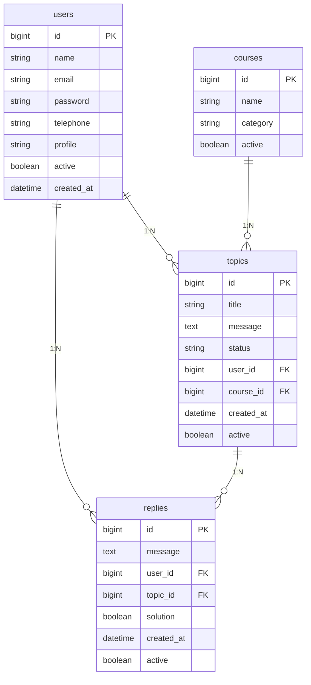
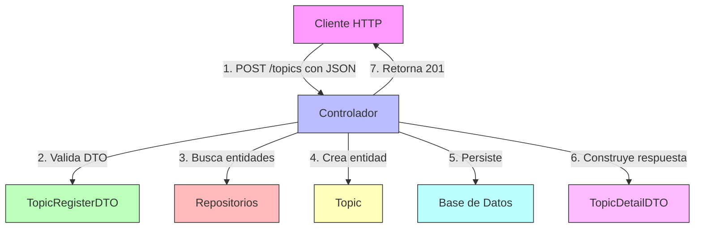

# ForoHub - API REST

API REST para un sistema de foros desarrollada con Spring Boot 3.x siguiendo una arquitectura MVC.

## 🏗️ Estructura del Proyecto

```yml
src/main/java/com/luiscm/forohub/
├── config/                             # Configuraciones de la aplicación
│   ├── SwaggerConfig.java              # @Configuration para documentación OpenAPI/Swagger
│   └── SecurityConfig.java             # @Configuration para seguridad y autenticación
│
├── controller/                         # Controladores REST (@RestController)
│   ├── TopicController.java            # Endpoints para gestión de temas
│   ├── UserController.java             # Endpoints para gestión de usuarios
│   ├── ReplyController.java            # Endpoints para gestión de respuestas
│   └── CourseController.java           # Endpoints para gestión de cursos
│
├── model/                              # Modelo de dominio
│   ├── dto/                            # Objetos de Transferencia de Datos (records)
│   │   ├── topic/                      # DTOs para temas
│   │   │   ├── TopicRegisterDTO.java   # @Valid record para registro de temas
│   │   │   ├── TopicListDTO.java       # Proyección para listado de temas
│   │   │   └── TopicDetailDTO.java     # DTO con detalles completos de tema
│   │   │
│   │   ├── user/                       # DTOs para usuarios
│   │   │   ├── UserRegisterDTO.java    # @Valid record para registro de usuarios
│   │   │   ├── UserListDTO.java        # Proyección para listado de usuarios
│   │   │   └── UserUpdateDTO.java      # @Valid record para actualización
│   │   │
│   │   └── reply/                      # DTOs para respuestas
│   │       ├── ReplyRegisterDTO.java   # @Valid record para nuevas respuestas
│   │       └── ReplyListDTO.java       # Proyección para listado de respuestas
│   │
│   ├── entity/                         # Entidades JPA (@Entity)
│   │   ├── Course.java                 # @Entity para cursos
│   │   ├── Topic.java                  # @Entity para temas con relaciones
│   │   ├── User.java                   # @Entity para usuarios
│   │   └── Reply.java                  # @Entity para respuestas
│   │
│   └── enums/                          # Enumeraciones
│       ├── Profile.java                # Roles de usuario (ADMIN, INSTRUCTOR, STUDENT)
│       └── StatusTopic.java            # Estados de tema (NO_RESPONDIDO, NO_SOLUCIONADO, etc.)
│
├── repository/                         # Repositorios JPA (JpaRepository)
│   ├── CourseRepository.java           # @Repository para cursos
│   ├── TopicRepository.java            # @Repository con consultas personalizadas
│   ├── UserRepository.java             # @Repository con consultas de usuarios
│   └── ReplyRepository.java            # @Repository para respuestas
│
├── service/                            # Lógica de negocio (@Service)
│   ├── CourseService.java              # Lógica para gestión de cursos
│   ├── TopicService.java               # Lógica para gestión de temas
│   ├── UserService.java                # Lógica para gestión de usuarios
│   └── ReplyService.java               # Lógica para gestión de respuestas
│
└── exception/                          # Manejo de excepciones
    ├── GlobalExceptionHandler.java     # @ControllerAdvice para manejo global
    ├── ResourceNotFoundException.java  # Excepción para recursos no encontrados
    └── ValidationError.java            # Estructura para errores de validación
```

## 📊 Diagrama de Base de Datos



```sql
    users {
        bigint id PK
        varchar(100) name
        varchar(100) email
        varchar(100) password
        text profile
        datetime creation_date
    }
    
    topics {
        bigint id PK
        varchar(100) title
        text message
        datetime creation_date
        enum status
        bigint author_id FK
        bigint course_id FK
    }
    
    replies {
        bigint id PK
        text message
        datetime creation_date
        boolean solution
        bigint author_id FK
        bigint topic_id FK
    }
    
    courses {
        bigint id PK
        varchar(100) name
        varchar(50) category
    }
```

## 📊 Diagrama de Endpoints

### 🔐 Autenticación

```http
POST   /api/auth/register      # Registrar nuevo usuario
POST   /api/auth/login         # Iniciar sesión
```

### 📝 Tópicos

```http
GET    /api/topics            # Listar tópicos (con paginación)
POST   /api/topics            # Crear nuevo tópico
GET    /api/topics/{id}       # Obtener tópico por ID
PUT    /api/topics/{id}       # Actualizar tópico
DELETE /api/topics/{id}       # Eliminar tópico
```

### 💬 Respuestas

```http
GET    /api/topics/{id}/replies  # Listar respuestas
POST   /api/topics/{id}/replies  # Responder
PUT    /api/replies/{id}         # Actualizar respuesta
DELETE /api/replies/{id}         # Eliminar respuesta
PUT    /api/replies/{id}/solution # Marcar como solución
```

### 👥 Usuarios (solo admin)

```http
GET    /api/users                    # Listar usuarios
GET    /api/users/{id}               # Obtener usuario por ID
PUT    /api/users/{id}               # Actualizar usuario
DELETE /api/users/{id}               # Desactivar usuario
```

### 📚 Cursos

```http
GET    /api/courses            # Listar cursos
GET    /api/courses/{id}       # Ver curso
```

### 🔍 Filtros y Búsquedas

```http
GET /api/topics?title=search        # Buscar tópicos por título
GET /api/topics?status=NO_RESPONDIDO   # Filtrar por estado
GET /api/topics?author=author       # Filtrar por autor
```

### 📊 Parámetros de Paginación (ejemplo)

```http
GET /api/topics?page=0&size=10&sort=creationDate,desc
```

### 📦 Ejemplo de JSON para POST/PUT

#### **Crear Tópico**

```json
{
  "title": "¿Cómo configurar Spring Security?",
  "message": "Estoy teniendo problemas para configurar la autenticación JWT...",
  "authorId": 1,
  "course": "Spring Boot"
}
```

#### **Crear Respuesta**

```json
{
  "message": "Primero necesitas agregar la dependencia de Spring Security...",
  "authorId": 2,
  "solution": true
}
```

#### **Autenticación**

```json
{
  "email": "usuario@ejemplo.com",
  "password": "contraseña123"
}
```

## 🚀 Plan de Desarrollo Detallado

### Fase 1: Configuración Inicial del Proyecto (Día 1)

**Objetivo**: Establecer la estructura base del proyecto y configurar las dependencias necesarias.

**Tareas Principales**:

1. **Configuración del Proyecto**
   - [x] Crear proyecto Spring Boot con Spring Initializr
   - [x] Configurar Java 17 como versión base
   - [x] Agregar dependencias esenciales:
     - Spring Web
     - Spring Data JPA
     - MySQL Driver
     - Lombok
     - Spring Boot DevTools
     - Spring Boot Validation
     - Flyway
     - SpringDoc OpenAPI

2. **Configuración de Base de Datos**
   - [x] Configurar `application.properties` con parámetros de conexión
   - [ ] Configurar perfiles para diferentes entornos (dev, test, prod)
   - [ ] Configurar pool de conexiones HikariCP
   - [ ] Habilitar logging SQL para desarrollo

3. **Estructura de Paquetes**

   ```text
   com.luiscm.forohub
   ├── config/           # Configuraciones de la aplicación
   ├── controller/       # Controladores REST
   ├── model/            # Entidades JPA
   │   └── dto/          # Objetos de Transferencia de Datos
   ├── repository/       # Repositorios JPA
   ├── service/          # Lógica de negocio
   └── exception/        # Manejo de excepciones
   ```

4. **Configuración de Flyway**
   - [ ] Crear directorio `src/main/resources/db/migration`
   - [ ] Crear migración inicial `V1__initial_schema.sql`
   - [ ] Configurar Flyway en `application.properties`
   - [ ] Crear datos iniciales en `V2__initial_data.sql`

**Configuración de Ejemplo**:

```properties
# ===============================
# = SERVER CONFIGURATION
# ===============================
server.port=8080
server.servlet.context-path=/api

# ===============================
# = DATABASE CONFIGURATION
# ===============================
spring.datasource.url=jdbc:mysql://localhost:3306/forohub?createDatabaseIfNotExist=true&useSSL=false&serverTimezone=UTC
spring.datasource.username=root
spring.datasource.password=0000
spring.datasource.driver-class-name=com.mysql.cj.jdbc.Driver

# HikariCP Configuration
spring.datasource.hikari.connection-timeout=20000
spring.datasource.hikari.maximum-pool-size=10

# JPA/Hibernate
spring.jpa.hibernate.ddl-auto=validate
spring.jpa.show-sql=true
spring.jpa.properties.hibernate.format_sql=true
spring.jpa.properties.hibernate.dialect=org.hibernate.dialect.MySQL8Dialect

# Flyway
spring.flyway.enabled=true
spring.flyway.locations=classpath:db/migration
spring.flyway.baseline-on-migrate=true
spring.flyway.validate-on-migrate=true

# Logging
logging.level.org.hibernate.SQL=DEBUG
logging.level.org.hibernate.type.descriptor.sql.BasicBinder=TRACE

# OpenAPI (SpringDoc)
springdoc.api-docs.path=/api-docs
springdoc.swagger-ui.path=/swagger-ui.html
springdoc.swagger-ui.operationsSorter=method
```

### Fase 2: Modelo de Dominio (Día 2)

**Objetivo**: Implementar las entidades JPA que representan el modelo de dominio.

**Entidades Principales**:

1. **User**

   ```java
   @Entity
   @Table(name = "users")
   public class User {
       @Id @GeneratedValue(strategy = GenerationType.IDENTITY)
       private Long id;
       
       @NotBlank @Column(nullable = false, length = 100)
       private String name;
       
       @NotBlank @Email @Column(nullable = false, unique = true, length = 100)
       private String email;
       
       @NotBlank @Column(nullable = false)
       private String password;
       
       @Column(length = 255)
       private String profile;
       
       @CreationTimestamp
       @Column(name = "creation_date", nullable = false, updatable = false)
       private LocalDateTime creationDate;
       
       @OneToMany(mappedBy = "author", cascade = CascadeType.ALL, orphanRemoval = true)
       private List<Topic> topics = new ArrayList<>();
       
       @OneToMany(mappedBy = "author", cascade = CascadeType.ALL, orphanRemoval = true)
       private List<Reply> replies = new ArrayList<>();
       
       // Getters, setters, equals, hashCode, toString
   }
   ```

### 2. Topic (Tema)

#### Flujo de Datos: POST /topics

##### 1. Cliente → Controlador

**Solicitud HTTP:**

```http
POST /topics
Content-Type: application/json

{
    "title": "Duda sobre Spring Boot",
    "message": "¿Cómo manejar excepciones globales?",
    "userId": 1,
    "courseId": 1
}
```

##### 2. Estructura del Flujo



```mermaid
Cliente HTTP
     │
     ▼ (1) POST /topics con JSON
Controlador (TopicController)
     │
     ▼ (2) Valida DTO
     │   - @Valid TopicRegisterDTO
     │
     ▼ (3) Busca entidades relacionadas
     │   - userRepository.findById()
     │   - courseRepository.findById()
     │
     ▼ (4) Crea entidad Topic
     │   - new Topic(data, user, course)
     │
     ▼ (5) Persiste
     │   - topicRepository.save(topic)
     │   - JPA genera INSERT
     │
     ▼ (6) Construye respuesta
     │   - Crea URI
     │   - Convierte a TopicDetailDTO
     │
     ▼ (7) Retorna 201 Created
     │   - Incluye Location header
     │   - Incluye DTO en el cuerpo
     ▼
Cliente HTTP
```

##### 3. Proceso Detallado

1. **Validación**:
   - Spring valida automáticamente las anotaciones `@NotBlank` y `@NotNull`
   - Si hay errores, lanza `MethodArgumentNotValidException`

2. **Búsqueda de Entidades**:

   ```java
   User user = userRepository.findById(userId)
       .orElseThrow(() -> new ResourceNotFoundException("Usuario no encontrado"));
   ```

3. **Creación de la Entidad**:
   - Se crea un nuevo `Topic` con los datos del DTO
   - Se establecen valores por defecto:
     - `status = NO_RESPONSE`
     - `active = true`
     - `createdAt` se establece automáticamente

4. **Persistencia**:
   - Se guarda el tema en la base de datos
   - Se genera el ID automáticamente

5. **Respuesta**:
   - Código: 201 Created
   - Header: `Location: /topics/{id}`
   - Body: `TopicDetailDTO` con los datos del tema creado

##### 4. Manejo de Errores

- **400 Bad Request**: Validación fallida
- **404 Not Found**: Usuario o curso no encontrado
- **500 Internal Server Error**: Error inesperado

##### 5. Entidades y DTOs Implicados

- `TopicRegisterDTO`: Datos de entrada
- `Topic`: Entidad principal
- `TopicDetailDTO`: Datos de salida
- `User` y `Course`: Entidades relacionadas

```java
@Entity
@Table(name = "topics")
@Getter
@NoArgsConstructor
@AllArgsConstructor
@EqualsAndHashCode(of = "id")
public class Topic {
    @Id
    @GeneratedValue(strategy = GenerationType.IDENTITY)
    private Long id;
    
    @Column(nullable = false, length = 100)
    private String title;
    
    @Column(columnDefinition = "TEXT", nullable = false)
    private String message;
    
    @Column(name = "created_at", nullable = false)
    private LocalDateTime createdAt;
    
    @Enumerated(EnumType.STRING)
    @Column(nullable = false, length = 20)
    private StatusTopic status;
    
    @ManyToOne(fetch = FetchType.LAZY)
    @JoinColumn(name = "user_id", nullable = false)
    private User user;
    
    @ManyToOne(fetch = FetchType.LAZY)
    @JoinColumn(name = "course_id", nullable = false)
    private Course course;
    
    @Column(columnDefinition = "TEXT", nullable = true)
    private String reply;
    
    // Constructor para registro
    public Topic(TopicRegisterDTO topicData, User user, Course course) {
        this.title = topicData.title();
        this.message = topicData.message();
        this.user = user;
        this.course = course;
        this.status = StatusTopic.NO_RESPONSE;
        this.createdAt = LocalDateTime.now();
        this.active = true;
    }
    
    // Métodos de negocio
    public void updateData(TopicUpdateDTO topicData) {
        if (topicData.title() != null) {
            this.title = topicData.title();
        }
        if (topicData.message() != null) {
            this.message = topicData.message();
        }
        if (topicData.status() != null) {
            this.status = topicData.status();
        }
    }
    
    public void deleteTopic() {
        this.active = false;
    }
       @Id @GeneratedValue(strategy = GenerationType.IDENTITY)
       private Long id;
       
       @NotBlank @Column(nullable = false, length = 100)
       private String title;
       
       @NotBlank @Column(nullable = false, columnDefinition = "TEXT")
       private String message;
       
       @CreationTimestamp
       @Column(name = "creation_date", nullable = false, updatable = false)
       private LocalDateTime creationDate;
       
       @Enumerated(EnumType.STRING)
       @Column(nullable = false, length = 20)
       private TopicStatus status = TopicStatus.NO_RESPONDIDO;
       
       @ManyToOne(fetch = FetchType.LAZY)
       @JoinColumn(name = "author_id", nullable = false)
       private User author;
       
       @ManyToOne(fetch = FetchType.LAZY)
       @JoinColumn(name = "course_id", nullable = false)
       private Course course;
       
       @OneToMany(mappedBy = "topic", cascade = CascadeType.ALL, orphanRemoval = true)
       private List<Reply> replies = new ArrayList<>();
       
       // Getters, setters, equals, hashCode, toString
   }
   ```

### 3. **Reply**

   ```java
   @Entity
   @Table(name = "replies")
   public class Reply {
       @Id @GeneratedValue(strategy = GenerationType.IDENTITY)
       private Long id;
       
       @NotBlank @Column(nullable = false, columnDefinition = "TEXT")
       private String message;
       
       @CreationTimestamp
       @Column(name = "creation_date", nullable = false, updatable = false)
       private LocalDateTime creationDate;
       
       @Column(nullable = false)
       private boolean solution = false;
       
       @ManyToOne(fetch = FetchType.LAZY)
       @JoinColumn(name = "author_id", nullable = false)
       private User author;
       
       @ManyToOne(fetch = FetchType.LAZY)
       @JoinColumn(name = "topic_id", nullable = false)
       private Topic topic;
       
       // Getters, setters, equals, hashCode, toString
   }
   ```

### 4. **Course**

   ```java
   @Entity
   @Table(name = "courses")
   public class Course {
       @Id @GeneratedValue(strategy = GenerationType.IDENTITY)
       private Long id;
       
       @NotBlank @Column(nullable = false, length = 100)
       private String name;
       
       @NotBlank @Column(nullable = false, length = 50)
       private String category;
       
       @OneToMany(mappedBy = "course")
       private List<Topic> topics = new ArrayList<>();
       
       // Getters, setters, equals, hashCode, toString
   }
   ```

### 5. **Enumeraciones**

   ```java
   public enum TopicStatus {
       NO_RESPONDIDO,
       NO_SOLUCIONADO,
       SOLUCIONADO,
       CERRADO
   }
   ```

**Tareas**:

- [ ] Implementar todas las entidades con sus relaciones
- [ ] Agregar validaciones con Bean Validation
- [ ] Implementar métodos de ayuda en las entidades
- [ ] Agregar documentación Javadoc
- [ ] Crear tests unitarios para las entidades

    ```properties
    spring.datasource.username=root
    spring.datasource.password=tu_contraseña
    spring.datasource.driver-class-name=com.mysql.cj.jdbc.Driver
    
    # JPA
    
    spring.jpa.hibernate.ddl-auto=validate
    spring.jpa.show-sql=true
    spring.jpa.properties.hibernate.format_sql=true
    
    # Flyway
    
    spring.flyway.enabled=true
    spring.flyway.baseline-on-migrate=true
    
    ```

**Consideraciones**:

- Usar Java 17 o superior
- Configurar correctamente las credenciales de la base de datos
- Habilitar el logging SQL para desarrollo

---

### Fase 2: Modelado de Datos

**Objetivo**: Definir las entidades principales del dominio y sus relaciones.

**Entidades Principales**:

1. **Usuario**: Para autenticación y autorización
2. **Tópico**: Publicaciones principales del foro
3. **Respuesta**: Comentarios a los tópicos

**Ejemplo de Entidad Tópico**:

```java
@Entity
@Table(name = "topicos")
@Getter
@Setter
@NoArgsConstructor
@AllArgsConstructor
public class Topico {
    @Id
    @GeneratedValue(strategy = GenerationType.IDENTITY)
    private Long id;
    
    @NotBlank
    @Size(min = 5, max = 100)
    private String titulo;
    
    @NotBlank
    @Size(min = 10)
    private String mensaje;
    
    private LocalDateTime fechaCreacion = LocalDateTime.now();
    
    @Enumerated(EnumType.STRING)
    private StatusTopico status = StatusTopico.NO_RESPONDIDO;
    
    @ManyToOne(fetch = FetchType.LAZY)
    @JoinColumn(name = "autor_id")
    private Usuario autor;
    
    @OneToMany(mappedBy = "topico", cascade = CascadeType.ALL, orphanRemoval = true)
    private List<Respuesta> respuestas = new ArrayList<>();
    
    public void agregarRespuesta(Respuesta respuesta) {
        respuestas.add(respuesta);
        respuesta.setTopico(this);
    }
}
```

**Consideraciones**:

- Usar validaciones de Bean Validation
- Definir correctamente las relaciones JPA
- Implementar métodos helper para mantener la integridad de las relaciones

---

### Fase 3: Implementación de Repositorios (Día 3)

**Objetivo**: Crear las interfaces de acceso a datos con Spring Data JPA.

**Repositorios Principales**:

1. **UserRepository**

   ```java
   @Repository
   public interface UserRepository extends JpaRepository<User, Long> {
       Optional<User> findByEmail(String email);
       boolean existsByEmail(String email);
       @Query("SELECT u FROM User u WHERE u.role = 'ADMIN'")
       List<User> findAllAdmins();
   }
   ```

2. **TopicRepository**

   ```java
   @Repository
   public interface TopicRepository extends JpaRepository<Topic, Long> {
       Page<Topic> findByStatus(TopicStatus status, Pageable pageable);
       Page<Topic> findByCourseId(Long courseId, Pageable pageable);
       Page<Topic> findByAuthorId(Long userId, Pageable pageable);
       
       @Query("SELECT t FROM Topic t WHERE LOWER(t.title) LIKE LOWER(CONCAT('%', :searchTerm, '%'))")
       Page<Topic> search(@Param("searchTerm") String searchTerm, Pageable pageable);
       
       @Query("SELECT t FROM Topic t JOIN t.course c WHERE c.category = :category")
       Page<Topic> findByCategory(@Param("category") String category, Pageable pageable);
   }
   ```

3. **ReplyRepository**

   ```java
   @Repository
   public interface ReplyRepository extends JpaRepository<Reply, Long> {
       List<Reply> findByTopicIdOrderByCreationDateAsc(Long topicId);
       List<Reply> findByAuthorId(Long authorId);
       Optional<Reply> findByIdAndTopicId(Long id, Long topicId);
       
       @Query("SELECT r FROM Reply r WHERE r.topic.id = :topicId AND r.solution = true")
       Optional<Reply> findSolutionForTopic(@Param("topicId") Long topicId);
       
       @Modifying
       @Query("UPDATE Reply r SET r.solution = false WHERE r.topic.id = :topicId AND r.id != :replyId")
       void unmarkOtherSolutions(@Param("topicId") Long topicId, @Param("replyId") Long replyId);
   }
   ```

4. **CourseRepository**

   ```java
   @Repository
   public interface CourseRepository extends JpaRepository<Course, Long> {
       List<Course> findByCategory(String category);
       
       @Query("SELECT DISTINCT c.category FROM Course c")
       List<String> findAllCategories();
   }
   ```

**Tareas de Implementación**:

- [ ] Crear interfaces de repositorio con métodos personalizados
- [ ] Implementar consultas derivadas de métodos
- [ ] Escribir consultas JPQL personalizadas cuando sea necesario
- [ ] Agregar métodos para paginación y ordenación
- [ ] Crear consultas con proyecciones para obtener solo los datos necesarios
- [ ] Implementar pruebas de repositorio con `@DataJpaTest`
- [ ] Agregar documentación Javadoc a los métodos personalizados

### Fase 4: Capa de Servicio (Día 4-5)

**Objetivo**: Implementar la lógica de negocio y la transformación entre entidades y DTOs.

**Servicios Principales**:

1. **UserService**

   ```java
   @Service
   @RequiredArgsConstructor
   public class UserService {
       private final UserRepository userRepository;
       private final PasswordEncoder passwordEncoder;
       
       @Transactional(readOnly = true)
       public UserDTO getUserProfile(Long userId) {
           User user = userRepository.findById(userId)
               .orElseThrow(() -> new ResourceNotFoundException("Usuario no encontrado"));
           return new UserDTO(user);
       }
       
       @Transactional
       public UserDTO registerUser(UserRegisterDTO userDTO) {
           if (userRepository.existsByEmail(userDTO.email())) {
               throw new BusinessException("El correo ya está registrado");
           }
           
           User user = new User();
           user.setName(userDTO.name());
           user.setEmail(userDTO.email());
           user.setPassword(passwordEncoder.encode(userDTO.password()));
           user.setRole(UserRole.USER);
           
           User savedUser = userRepository.save(user);
           return new UserDTO(savedUser);
       }
       
       @Transactional
       public void updateProfile(Long userId, UserUpdateDTO userDTO) {
           User user = userRepository.findById(userId)
               .orElseThrow(() -> new ResourceNotFoundException("Usuario no encontrado"));
               
           user.setName(userDTO.name());
           user.setProfile(userDTO.profile());
           
           userRepository.save(user);
       }
   }
   ```

2. **TopicService**

   ```java
   @Service
   @RequiredArgsConstructor
   public class TopicService {
       private final TopicRepository topicRepository;
       private final UserRepository userRepository;
       private final CourseRepository courseRepository;
       private final ModelMapper modelMapper;
       
       @Transactional(readOnly = true)
       public Page<TopicDTO> listTopics(Pageable pageable) {
           return topicRepository.findAll(pageable)
               .map(topic -> modelMapper.map(topic, TopicDTO.class));
       }
       
       @Transactional
       public TopicDTO createTopic(TopicRegisterDTO topicDTO, Long authorId) {
           User author = userRepository.findById(authorId)
               .orElseThrow(() -> new ResourceNotFoundException("Usuario no encontrado"));
               
           Course course = courseRepository.findById(topicDTO.courseId())
               .orElseThrow(() -> new ResourceNotFoundException("Curso no encontrado"));
           
           Topic topic = new Topic();
           topic.setTitle(topicDTO.title());
           topic.setMessage(topicDTO.message());
           topic.setAuthor(author);
           topic.setCourse(course);
           topic.setStatus(TopicStatus.NO_RESPONDIDO);
           
           Topic savedTopic = topicRepository.save(topic);
           return modelMapper.map(savedTopic, TopicDTO.class);
       }
       
       @Transactional
       public TopicDTO updateTopicStatus(Long topicId, TopicStatus status) {
           Topic topic = topicRepository.findById(topicId)
               .orElseThrow(() -> new ResourceNotFoundException("Tópico no encontrado"));
               
           topic.setStatus(status);
           Topic updatedTopic = topicRepository.save(topic);
           return modelMapper.map(updatedTopic, TopicDTO.class);
       }
   }
   ```

**Tareas de Implementación**:

- [ ] Implementar servicios con lógica de negocio
- [ ] Manejar transacciones con `@Transactional`
- [ ] Implementar mapeo entre entidades y DTOs (usando ModelMapper o MapStruct)
- [ ] Manejar excepciones de negocio
- [ ] Implementar validación de datos
- [ ] Escribir pruebas unitarias para los servicios
- [ ] Implementar logging adecuado
- [ ] Agregar documentación Javadoc

### Fase 5: Controladores REST (Día 6)

**Objetivo**: Implementar los endpoints de la API REST.

**Controladores Principales**:

1. **AuthController**

   ```java
   @RestController
   @RequestMapping("/api/auth")
   @RequiredArgsConstructor
   public class AuthController {
       private final UserService userService;
       private final JwtTokenProvider tokenProvider;
       private final AuthenticationManager authenticationManager;
       
       @PostMapping("/register")
       @ResponseStatus(HttpStatus.CREATED)
       public UserDTO register(@Valid @RequestBody UserRegisterDTO userDTO) {
           return userService.registerUser(userDTO);
       }
       
       @PostMapping("/login")
       public JwtAuthenticationResponse login(@Valid @RequestBody LoginRequest loginRequest) {
           Authentication authentication = authenticationManager.authenticate(
               new UsernamePasswordAuthenticationToken(
                   loginRequest.getEmail(),
                   loginRequest.getPassword()
               )
           );
           
           SecurityContextHolder.getContext().setAuthentication(authentication);
           String jwt = tokenProvider.generateToken(authentication);
           
           return new JwtAuthenticationResponse(jwt);
       }
       
       @GetMapping("/me")
       @PreAuthorize("isAuthenticated()")
       public UserDTO getCurrentUser(@CurrentUser UserPrincipal currentUser) {
           return userService.getUserProfile(currentUser.getId());
       }
   }
   ```

2. **TopicController**

   ```java
   @RestController
   @RequestMapping("/api/topics")
   @RequiredArgsConstructor
   public class TopicController {
       private final TopicService topicService;
       
       @GetMapping
       public ResponseEntity<Page<TopicDTO>> listTopics(
               @RequestParam(defaultValue = "0") int page,
               @RequestParam(defaultValue = "10") int size,
               @RequestParam(defaultValue = "creationDate,desc") String[] sort) {
           
           Pageable pageable = PageRequest.of(page, size, Sort.by(sort));
           Page<TopicDTO> topics = topicService.listTopics(pageable);
           
           return ResponseEntity.ok(topics);
       }
       
       @PostMapping
       @ResponseStatus(HttpStatus.CREATED)
       @PreAuthorize("isAuthenticated()")
       public TopicDTO createTopic(
               @Valid @RequestBody TopicRegisterDTO topicDTO,
               @CurrentUser UserPrincipal currentUser) {
           
           return topicService.createTopic(topicDTO, currentUser.getId());
       }
       
       @PutMapping("/{id}/status")
       @PreAuthorize("hasRole('MODERATOR') or hasRole('ADMIN')")
       public TopicDTO updateTopicStatus(
               @PathVariable Long id,
               @RequestParam TopicStatus status) {
           
           return topicService.updateTopicStatus(id, status);
       }
   }
   ```

**Tareas de Implementación**:

- [ ] Implementar endpoints REST siguiendo las mejores prácticas
- [ ] Manejar códigos de estado HTTP apropiados
- [ ] Implementar validación de entrada
- [ ] Manejo de excepciones global
- [ ] Documentación con Swagger/OpenAPI
- [ ] Implementar paginación y ordenación
- [ ] Escribir pruebas de controlador con MockMvc
- [ ] Agregar documentación Javadoc

### Fase 6: Seguridad (Día 7)

**Objetivo**: Implementar autenticación y autorización segura.

**Configuración de Seguridad**:

1. **Configuración de Spring Security**

   ```java
   @Configuration
   @EnableWebSecurity
   @EnableGlobalMethodSecurity(prePostEnabled = true)
   @RequiredArgsConstructor
   public class SecurityConfig {
       private final JwtAuthenticationEntryPoint unauthorizedHandler;
       private final UserDetailsService userDetailsService;
       
       @Bean
       public JwtAuthenticationFilter jwtAuthenticationFilter() {
           return new JwtAuthenticationFilter();
       }
       
       @Bean
       public PasswordEncoder passwordEncoder() {
           return new BCryptPasswordEncoder();
       }
       
       @Bean
       public SecurityFilterChain filterChain(HttpSecurity http) throws Exception {
           http
               .cors().and()
               .csrf().disable()
               .exceptionHandling()
                   .authenticationEntryPoint(unauthorizedHandler)
                   .and()
               .sessionManagement()
                   .sessionCreationPolicy(SessionCreationPolicy.STATELESS)
                   .and()
               .authorizeRequests()
                   .antMatchers("/api/auth/**").permitAll()
                   .antMatchers("/v3/api-docs/**", "/swagger-ui/**").permitAll()
                   .anyRequest().authenticated();
                   
           http.addFilterBefore(jwtAuthenticationFilter(), UsernamePasswordAuthenticationFilter.class);
           
           return http.build();
       }
   }
   ```

2. **Filtro de Autenticación JWT**

   ```java
   public class JwtAuthenticationFilter extends OncePerRequestFilter {
       @Override
       protected void doFilterInternal(HttpServletRequest request,
                                     HttpServletResponse response,
                                     FilterChain filterChain) throws ServletException, IOException {
           try {
               String jwt = getJwtFromRequest(request);
               if (jwt != null && tokenProvider.validateToken(jwt)) {
                   String username = tokenProvider.getUserNameFromJWT(jwt);
                   
                   UserDetails userDetails = userDetailsService.loadUserByUsername(username);
                   UsernamePasswordAuthenticationToken authentication = new UsernamePasswordAuthenticationToken(
                           userDetails, null, userDetails.getAuthorities());
                   authentication.setDetails(new WebAuthenticationDetailsSource().buildDetails(request));
                   
                   SecurityContextHolder.getContext().setAuthentication(authentication);
               }
           } catch (Exception ex) {
               logger.error("Could not set user authentication in security context", ex);
           }
           
           filterChain.doFilter(request, response);
       }
   }
   ```

**Tareas de Implementación**:

- [ ] Configurar Spring Security con JWT
- [ ] Implementar autenticación con email/contraseña
- [ ] Configurar CORS
- [ ] Implementar manejo de roles y permisos
- [ ] Configurar HTTPS
- [ ] Implementar rate limiting
- [ ] Configurar headers de seguridad
- [ ] Escribir pruebas de seguridad

### Fase 7: Pruebas (Día 8)

**Objetivo**: Asegurar la calidad del código mediante pruebas automatizadas.

**Tipos de Pruebas**:

1. **Pruebas Unitarias**
   - Servicios
   - Utilidades
   - Validadores

2. **Pruebas de Integración**
   - Controladores REST
   - Repositorios JPA
   - Seguridad

3. **Pruebas de Rendimiento**
   - Carga
   - Estrés

4. **Pruebas de Seguridad**
   - Autenticación
   - Autorización
   - Validación de entrada

**Herramientas**:

- JUnit 5
- Mockito
- Testcontainers
- JMeter/Gatling
- OWASP ZAP

### Fase 8: Documentación y Despliegue (Día 9)

**Documentación**:

- Documentación de API con SpringDoc OpenAPI
- Guía de instalación
- Guía de desarrollo
- Documentación de despliegue

**Despliegue**:

- Configuración de perfiles
- Scripts de base de datos
- Configuración de Docker
- CI/CD con GitHub Actions

### Fase 9: Mejoras y Optimizaciones (Día 10+)

**Mejoras de Rendimiento**:

- Caché con Spring Cache
- Paginación eficiente
- Consultas optimizadas

**Nuevas Características**:

- Búsqueda avanzada con Elasticsearch
- Notificaciones en tiempo real con WebSocket
- Exportación de datos
- Gráficos y estadísticas

**Seguridad Avanzada**:

- Autenticación de dos factores
- Auditoría de seguridad
- Monitoreo de actividades sospechosas

1. Crear interfaces que extiendan de `JpaRepository`
2. Implementar consultas personalizadas cuando sea necesario
3. Manejar la paginación y ordenamiento

**Ejemplo de Repositorio**:

```java
public interface TopicoRepository extends JpaRepository<Topico, Long> {
    
    // Consulta derivada del nombre del método
    boolean existsByTitulo(String titulo);
    
    // Consulta JPQL personalizada
    @Query("SELECT t FROM Topico t WHERE t.autor.id = :usuarioId")
    Page<Topico> findByUsuarioId(
        @Param("usuarioId") Long usuarioId, 
        Pageable paginacion
    );
    
    // Búsqueda por estado y título
    Page<Topico> findByStatusAndTituloContainingIgnoreCase(
        StatusTopico status, 
        String titulo, 
        Pageable paginacion
    );
}
```

**Consideraciones**:

- Usar nombres de métodos descriptivos
- Implementar paginación para consultas que devuelvan múltiples resultados
- Usar consultas nativas solo cuando sea estrictamente necesario

---

### Fase 4: Implementación de Servicios

**Objetivo**: Implementar la lógica de negocio de la aplicación.

**Tareas Principales**:

1. Crear clases de servicio con anotación `@Service`
2. Implementar las reglas de negocio
3. Manejar las transacciones con `@Transactional`
4. Validar los datos de entrada

**Ejemplo de Servicio**:

```java
@Service
@RequiredArgsConstructor
public class TopicoService {
    
    private final TopicoRepository topicoRepository;
    private final UsuarioRepository usuarioRepository;
    
    @Transactional(readOnly = true)
    public Page<TopicoDTO> listarTopicos(Pageable paginacion) {
        return topicoRepository.findAll(paginacion)
            .map(TopicoDTO::new);
    }
    
    @Transactional
    public TopicoDTO guardarTopico(TopicoRegistroDTO datos) {
        // Validar que no exista un tópico con el mismo título
        if (topicoRepository.existsByTitulo(datos.titulo())) {
            throw new IllegalArgumentException("Ya existe un tópico con este título");
        }
        
        // Obtener el usuario autenticado
        Usuario autor = usuarioRepository.findById(datos.autorId())
            .orElseThrow(() -> new ResourceNotFoundException("Usuario no encontrado"));
        
        // Crear y guardar el nuevo tópico
        Topico topico = new Topico();
        topico.setTitulo(datos.titulo());
        topico.setMensaje(datos.mensaje());
        topico.setAutor(autor);
        
        return new TopicoDTO(topicoRepository.save(topico));
    }
    
    @Transactional
    public TopicoDTO actualizarTopico(Long id, TopicoActualizarDTO datos) {
        // Buscar el tópico existente
        Topico topico = topicoRepository.findById(id)
            .orElseThrow(() -> new ResourceNotFoundException("Tópico no encontrado"));
        
        // Validar que el usuario sea el autor
        if (!topico.getAutor().getId().equals(datos.usuarioId())) {
            throw new AuthorizationException("No autorizado para actualizar este tópico");
        }
        
        // Actualizar propiedades
        if (datos.titulo() != null) {
            topico.setTitulo(datos.titulo());
        }
        
        if (datos.mensaje() != null) {
            topico.setMensaje(datos.mensaje());
        }
        
        if (datos.status() != null) {
            topico.setStatus(datos.status());
        }
        
        return new TopicoDTO(topicoRepository.save(topico));
    }
    
    @Transactional
    public void eliminarTopico(Long id, Long usuarioId) {
        Topico topico = topicoRepository.findById(id)
            .orElseThrow(() -> new ResourceNotFoundException("Tópico no encontrado"));
            
        // Validar que el usuario sea el autor o un administrador
        if (!topico.getAutor().getId().equals(usuarioId)) {
            throw new AuthorizationException("No autorizado para eliminar este tópico");
        }
        
        topicoRepository.delete(topico);
    }
}
```

**Consideraciones**:

- Separar claramente la lógica de negocio de los controladores
- Usar DTOs para la transferencia de datos
- Manejar adecuadamente las transacciones
- Validar los permisos del usuario

---

### Fase 5: Implementación de Controladores REST

**Objetivo**: Exponer los endpoints de la API REST.

**Tareas Principales**:

1. Crear controladores con anotación `@RestController`
2. Mapear los endpoints a los métodos correspondientes
3. Manejar los códigos de estado HTTP apropiados
4. Documentar la API con Swagger/OpenAPI

**Ejemplo de Controlador**:

```java
@RestController
@RequestMapping("/api/topicos")
@RequiredArgsConstructor
@Tag(name = "Tópicos", description = "API para la gestión de tópicos del foro")
public class TopicoController {
    
    private final TopicoService topicoService;
    
    @PostMapping
    @Transactional
    @Operation(summary = "Crear un nuevo tópico")
    @ApiResponses(value = {
        @ApiResponse(responseCode = "201", description = "Tópico creado exitosamente"),
        @ApiResponse(responseCode = "400", description = "Datos de entrada inválidos"),
        @ApiResponse(responseCode = "401", description = "No autenticado")
    })
    public ResponseEntity<TopicoDTO> crearTopico(
            @RequestBody @Valid TopicoRegistroDTO datos,
            UriComponentsBuilder uriBuilder) {
        
        TopicoDTO topico = topicoService.guardarTopico(datos);
        var uri = uriBuilder.path("/api/topicos/{id}")
            .buildAndExpand(topico.id())
            .toUri();
        
        return ResponseEntity.created(uri).body(topico);
    }
    
    @GetMapping
    @Operation(summary = "Listar tópicos con paginación")
    public ResponseEntity<Page<TopicoDTO>> listarTopicos(
            @PageableDefault(size = 10, sort = "fechaCreacion", 
                           direction = Sort.Direction.DESC) Pageable paginacion) {
        
        return ResponseEntity.ok(topicoService.listarTopicos(paginacion));
    }
    
    @GetMapping("/{id}")
    @Operation(summary = "Obtener un tópico por su ID")
    public ResponseEntity<TopicoDetalleDTO> obtenerTopico(@PathVariable Long id) {
        return ResponseEntity.ok(topicoService.obtenerTopicoPorId(id));
    }
    
    @PutMapping("/{id}")
    @Transactional
    @Operation(summary = "Actualizar un tópico existente")
    public ResponseEntity<TopicoDTO> actualizarTopico(
            @PathVariable Long id,
            @RequestBody @Valid TopicoActualizarDTO datos) {
        
        return ResponseEntity.ok(topicoService.actualizarTopico(id, datos));
    }
    
    @DeleteMapping("/{id}")
    @Transactional
    @Operation(summary = "Eliminar un tópico")
    @ResponseStatus(HttpStatus.NO_CONTENT)
    public void eliminarTopico(
            @PathVariable Long id,
            @RequestParam Long usuarioId) {
        
        topicoService.eliminarTopico(id, usuarioId);
    }
}
```

**Consideraciones**:

- Usar anotaciones de validación para los datos de entrada
- Documentar los endpoints con Swagger/OpenAPI
- Manejar adecuadamente los códigos de estado HTTP
- Implementar paginación y ordenamiento

---

### Fase 6: Manejo de Excepciones Global

**Objetivo**: Manejar de manera centralizada las excepciones de la aplicación.

**Tareas Principales**:

1. Crear manejadores de excepciones globales
2. Definir respuestas de error estandarizadas
3. Mapear excepciones a códigos de estado HTTP apropiados

**Ejemplo de Manejador de Excepciones**:

```java
@ControllerAdvice
public class GlobalExceptionHandler extends ResponseEntityExceptionHandler {
    
    @ExceptionHandler(ResourceNotFoundException.class)
    public ResponseEntity<ErrorDTO> handleResourceNotFoundException(
            ResourceNotFoundException ex) {
                
        ErrorDTO error = new ErrorDTO(
            LocalDateTime.now(),
            HttpStatus.NOT_FOUND.value(),
            "Recurso no encontrado",
            ex.getMessage()
        );
        
        return new ResponseEntity<>(error, HttpStatus.NOT_FOUND);
    }
    
    @ExceptionHandler(AuthorizationException.class)
    public ResponseEntity<ErrorDTO> handleAuthorizationException(
            AuthorizationException ex) {
                
        ErrorDTO error = new ErrorDTO(
            LocalDateTime.now(),
            HttpStatus.FORBIDDEN.value(),
            "Acceso denegado",
            ex.getMessage()
        );
        
        return new ResponseEntity<>(error, HttpStatus.FORBIDDEN);
    }
    
    @Override
    protected ResponseEntity<Object> handleMethodArgumentNotValid(
            MethodArgumentNotValidException ex, 
            HttpHeaders headers, 
            HttpStatusCode status, 
            WebRequest request) {
                
        List<String> errores = ex.getFieldErrors().stream()
            .map(error -> String.format("Campo '%s': %s", 
                error.getField(), 
                error.getDefaultMessage()))
            .collect(Collectors.toList());
            
        ErrorDTO error = new ErrorDTO(
            LocalDateTime.now(),
            HttpStatus.BAD_REQUEST.value(),
            "Error de validación",
            "Error en los datos de entrada",
            errores
        );
        
        return new ResponseEntity<>(error, HttpStatus.BAD_REQUEST);
    }
    
    @ExceptionHandler(Exception.class)
    public ResponseEntity<ErrorDTO> handleGeneralException(Exception ex) {
        ErrorDTO error = new ErrorDTO(
            LocalDateTime.now(),
            HttpStatus.INTERNAL_SERVER_ERROR.value(),
            "Error interno del servidor",
            "Ocurrió un error inesperado"
        );
        
        // Registrar el error en el log
        ex.printStackTrace();
        
        return new ResponseEntity<>(error, HttpStatus.INTERNAL_SERVER_ERROR);
    }
}
```

**Consideraciones**:

- Crear una clase de error estandarizada
- Manejar tanto excepciones de negocio como técnicas
- Registrar los errores en el log
- No exponer detalles sensibles en los mensajes de error

---

## 📌 Próximos Pasos

1. **Autenticación y Autorización**
   - Implementar JWT para autenticación
   - Configurar roles y permisos
   - Proteger los endpoints según los roles

2. **Documentación de la API**
   - Configurar Swagger/OpenAPI
   - Documentar todos los endpoints
   - Proporcionar ejemplos de solicitudes/respuestas

3. **Pruebas**
   - Pruebas unitarias con JUnit y Mockito
   - Pruebas de integración con TestContainers
   - Pruebas de carga con JMeter

4. **Despliegue**
   - Configurar Docker
   - Crear perfiles para diferentes entornos
   - Configurar CI/CD

## 5. Monitoreo

- [ ] Configurar Spring Boot Actuator
- [ ] Health checks personalizados
- [ ] Métricas personalizadas
- [ ] Logging centralizado

## 6. Optimización

- [ ] Implementar caché con Caffeine
- [ ] Paginación en todos los listados
- [ ] Filtros de búsqueda avanzados
- [ ] Consultas optimizadas con índices

## 7. CI/CD

- [ ] Configurar GitHub Actions
- [ ] Pipeline de pruebas automatizadas
- [ ] Análisis estático de código
- [ ] Despliegue continuo en diferentes entornos

## 🚀 Características Futuras

- [ ] Búsqueda avanzada de temas
- [ ] Sistema de votos para respuestas
- [ ] Etiquetas para temas
- [ ] Suscripciones a temas
- [ ] Notificaciones en tiempo real
- [ ] Exportación de datos
- [ ] API para estadísticas
- [ ] Integración con OAuth2
- [ ] Documentación interactiva con Swagger UI

## 🧪 Pruebas

- [ ] Pruebas unitarias (JUnit 5)
- [ ] Pruebas de integración con `@DataJpaTest`
- [ ] Pruebas de controlador con `@WebMvcTest`
- [ ] Pruebas de carga
- [ ] Pruebas de seguridad
- [ ] Pruebas de controladores con `@WebMvcTest`
- [ ] Pruebas de seguridad
- [ ] Pruebas de rendimiento

### 📚 Fase 8: Documentación y Despliegue (Día 9)

- [ ] Documentar API con Swagger/OpenAPI
- [ ] Crear colección de Postman
- [ ] Configurar Docker y Docker Compose
- [ ] Preparar scripts de despliegue
- [ ] Configurar CI/CD básico

### 🚀 Fase 9: Mejoras y Optimizaciones (Día 10+)

- [ ] Implementar caché con Spring Cache
- [ ] Configurar WebSocket para notificaciones en tiempo real
- [ ] Mejorar manejo de archivos (imágenes de perfil)
- [ ] Implementar búsqueda avanzada con Elasticsearch
- [ ] Configurar monitoreo con Actuator/Prometheus
- Mensajes de error personalizados
- Manejo de excepciones global

### Fase 9: Pruebas Unitarias

{{ ... }}

- Pruebas de controlador con MockMvc
- Pruebas de integración

### Fase 10: Documentación

- Documentación de API con Swagger/OpenAPI
- README detallado
- Guía de instalación y configuración

### Fase 11: Despliegue

- Configuración para producción
- Variables de entorno
- Scripts de despliegue

### Fase 12: Monitoreo

- Actuator
- Health checks
- Métricas

### Fase 13: Optimización

- Caché
- Paginación
- Filtros de búsqueda

### Fase 14: CI/CD (Opcional)

- GitHub Actions
- Pruebas automatizadas
- Despliegue continuo

## 🛠️ Configuración Inicial

### Requisitos Previos

- Java 17 o superior
- Maven 3.8+
- MySQL 8.0+
- Git

### Instalación

1. Clonar el repositorio:

   ```bash
   git clone [URL_DEL_REPOSITORIO]
   cd ForoHub
   ```

2. Configurar la base de datos:
   - Crear una base de datos MySQL llamada `forohub`
   - Configurar las credenciales en `application.properties`

3. Ejecutar la aplicación:

   ```bash
   mvn spring-boot:run
   ```

4. Acceder a la documentación de la API:
   - Swagger UI: <http://localhost:8080/swagger-ui.html>
   - OpenAPI JSON: <http://localhost:8080/v3/api-docs>

## 📚 Recursos de Aprendizaje

- [Documentación de Spring Boot](https://spring.io/projects/spring-boot)
- [Spring Data JPA](https://spring.io/projects/spring-data-jpa)
{{ ... }}
- [Documentación de MySQL](https://dev.mysql.com/doc/)

## 🤝 Contribución

1. Hacer fork del proyecto
2. Crear una rama para tu feature (`git checkout -b feature/AmazingFeature`)
3. Hacer commit de tus cambios (`git commit -m 'Add some AmazingFeature'`)
4. Hacer push a la rama (`git push origin feature/AmazingFeature`)
5. Abrir un Pull Request

## 📄 Licencia

Este proyecto está bajo la Licencia MIT. Ver el archivo `LICENSE` para más detalles.

---

Desarrollado con ❤️ para el Challenge de Backend de Alura
