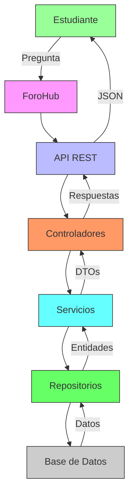
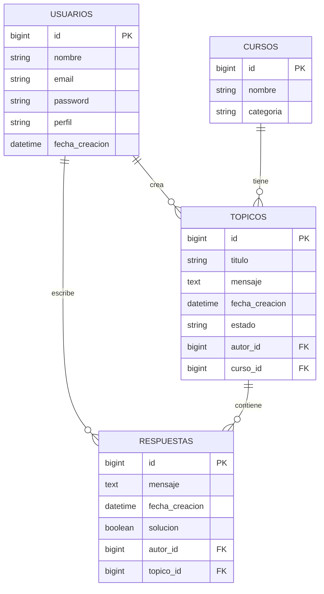

# 🍽️ Arquitectura MVC: El Restaurante de tu Aplicación

## 🏢 Introducción

Imagina que tu aplicación es un restaurante de lujo. Cada parte de la arquitectura MVC (Modelo-Vista-Controlador) tiene su equivalente en este restaurante. Vamos a desglosarlo de manera detallada.

## 📁 Estructura de Directorios

```mermaid
graph TD
    A[src/main/java/com/ejemplo/restaurante] --> B[config/]
    A --> C[controller/]
    A --> D[model/]
    A --> E[repository/]
    A --> F[service/]
    A --> G[dto/]
    A --> H[exception/]
    
    B --> B1[SeguridadConfig.java]
    B --> B2[SwaggerConfig.java]
    
    C --> C1[PlatoController.java]
    C --> C2[PedidoController.java]
    
    D --> D1[Plato.java]
    D --> D2[Pedido.java]
    D --> D3[Ingrediente.java]
    D --> D4[Usuario.java]
    
    E --> E1[PlatoRepository.java]
    E --> E2[PedidoRepository.java]
    
    F --> F1[PlatoService.java]
    F --> F2[PedidoService.java]
    
    G --> G1[PlatoDTO.java]
    G --> G2[PedidoDTO.java]
    
    H --> H1[GlobalExceptionHandler.java]
    H --> H2[RecursoNoEncontradoException.java]
    
    style A fill:#f9f,stroke:#333,stroke-width:2px
    style B fill:#bbf,stroke:#333
    style C fill:#bbf,stroke:#333
    style D fill:#bbf,stroke:#333
    style E fill:#bbf,stroke:#333
    style F fill:#bbf,stroke:#333
    style G fill:#bbf,stroke:#333
    style H fill:#bbf,stroke:#333
```



### 📋 Explicación de la Estructura

- **`config/`** ⚙️
  - Configuraciones globales de la aplicación
  - Seguridad, Swagger, Beans de Spring

- **`controller/`** 🎭
  - Manejan las rutas HTTP
  - Reciben peticiones y devuelven respuestas

- **`model/`** 🏗️
  - Entidades de la base de datos
  - Representan tablas y relaciones

- **`repository/`** 🗄️
  - Acceso a datos
  - Consultas a la base de datos

- **`service/`** 👨‍🍳
  - Lógica de negocio
  - Orquestan operaciones entre repositorios

- **`dto/`** 📦
  - Objetos para transferencia de datos
  - Versiones simplificadas de las entidades

- **`exception/`** ⚠️
  - Manejo personalizado de errores
  - Clases de excepción y manejadores

## 🏗️ La Estructura del Restaurante (MVC)

### 1. **El Comedor (Cliente)**

- **Qué es**: Donde los clientes (usuarios) interactúan con el restaurante.
- **En la app**: El navegador o aplicación móvil que hace las peticiones.
- **Tecnologías típicas**: React, Angular, Vue.js, o cualquier cliente que consuma tu API.

### 2. **El Mesero (Controller)** 🎭

- **Qué hace**: Recibe pedidos y lleva respuestas a los clientes.
- **En la app**: Los controladores que manejan las rutas HTTP.
- **Responsabilidades**:
  - Recibir peticiones HTTP
  - Validar datos de entrada
  - Llamar a los servicios correspondientes
  - Devolver respuestas HTTP

```java
@RestController
@RequestMapping("/api/platos")
public class PlatoController {
    private final PlatoService platoService;
    
    @GetMapping("/{id}")
    public PlatoDTO obtenerPlato(@PathVariable Long id) {
        return platoService.obtenerPorId(id);
    }
}
```

### 3. **El Cocinero (Service)** 👨‍🍳

- **Qué hace**: Prepara los platos (procesa la lógica de negocio).
- **En la app**: Las clases de servicio que contienen la lógica principal.
- **Responsabilidades**:
  - Aplicar reglas de negocio
  - Orquestar operaciones entre repositorios
  - Manejar transacciones
  - Transformar datos entre entidades y DTOs

```java
@Service
@RequiredArgsConstructor
public class PlatoService {
    private final PlatoRepository platoRepository;
    private final IngredienteRepository ingredienteRepository;
    
    public PlatoDTO crearPlato(PlatoRegistroDTO dto) {
        // Validar que los ingredientes existen
        List<Ingrediente> ingredientes = ingredienteRepository
            .findAllById(dto.ingredientesIds());
            
        // Crear el plato
        Plato plato = new Plato();
        plato.setNombre(dto.nombre());
        plato.setIngredientes(ingredientes);
        plato.setPrecio(calcularPrecio(ingredientes));
        
        // Guardar y devolver DTO
        return new PlatoDTO(platoRepository.save(plato));
    }
}
```

### 4. **El Almacén (Repository)** 🏭

- **Qué hace**: Gestiona el almacenamiento de ingredientes (datos).
- **En la app**: Las interfaces que manejan el acceso a la base de datos.
- **Responsabilidades**:
  - Operaciones CRUD
  - Consultas personalizadas
  - Manejo de transacciones a bajo nivel

```java
@Repository
public interface PlatoRepository extends JpaRepository<Plato, Long> {
    // Consultas personalizadas
    List<Plato> findByCategoriaAndPrecioLessThan(
        String categoria, 
        BigDecimal precioMaximo
    );
    
    @Query("SELECT p FROM Plato p WHERE p.ingredientes.size > :minIngredientes")
    List<Plato> findPlatosConMuchosIngredientes(
        @Param("minIngredientes") int minIngredientes
    );
}
```

### 5. **Los Ingredientes (Model/Entities)** 🥩🥦

- **Qué son**: Las materias primas con las que se preparan los platos.
- **En la app**: Las clases que representan tablas en la base de datos.
- **Responsabilidades**:
  - Definir la estructura de los datos
  - Mantener las relaciones entre entidades
  - Validar datos a nivel de campo

```java
@Entity
@Table(name = "platos")
@Getter
@NoArgsConstructor
public class Plato {
    @Id
    @GeneratedValue(strategy = GenerationType.IDENTITY)
    private Long id;
    
    @NotBlank
    private String nombre;
    
    private String descripcion;
    
    @ManyToMany
    @JoinTable(
        name = "plato_ingrediente",
        joinColumns = @JoinColumn(name = "plato_id"),
        inverseJoinColumns = @JoinColumn(name = "ingrediente_id")
    )
    private Set<Ingrediente> ingredientes = new HashSet<>();
    
    @ManyToOne(fetch = FetchType.LAZY)
    private Categoria categoria;
    
    // Métodos de negocio
    public void agregarIngrediente(Ingrediente ingrediente) {
        this.ingredientes.add(ingrediente);
        ingrediente.getPlatos().add(this);
    }
}
```

## 🔄 Flujo de una Petición Típica

1. **El cliente hace un pedido** 🧑

   ```http
   POST /api/pedidos
   {
     "platoId": 42,
     "cantidad": 2,
     "notas": "Sin cebolla por favor"
   }
   ```

2. **El mesero (Controller) recibe el pedido** 🎭
   - Valida que el JSON esté bien formado
   - Verifica autenticación/autorización
   - Pasa el control al cocinero (Service)

3. **El cocinero (Service) prepara el pedido** 👨‍🍳
   - Verifica que el plato existe
   - Comprueba ingredientes disponibles
   - Aplica descuentos o promociones
   - Registra el pedido

4. **El almacén (Repository) guarda la información** 🏭
   - Crea un nuevo registro de pedido
   - Actualiza el inventario
   - Maneja transacciones

5. **Se sirve la respuesta al cliente** 🍽️

   ```json
   {
     "id": 123,
     "estado": "EN_PREPARACION",
     "tiempoEstimado": "20-30 minutos",
     "total": 24.99
   }
   ```

## 🏆 Beneficios de Esta Arquitectura

1. **Separación de Responsabilidades**
   - Cada componente tiene una tarea específica
   - Fácil de mantener y probar

2. **Escalabilidad**
   - Puedes escalar cada componente por separado
   - Fácil de distribuir en microservicios

3. **Mantenibilidad**
   - Código organizado y predecible
   - Nuevos desarrolladores pueden entender rápidamente la estructura

4. **Flexibilidad**
   - Puedes cambiar la base de datos sin afectar la lógica de negocio
   - Fácil de agregar nuevas funcionalidades

## 🛠️ Herramientas Recomendadas

- **Spring Boot**: El chef ejecutivo que coordina todo
- **Spring Data JPA**: El sistema de gestión del almacén
- **Spring Security**: El equipo de seguridad del restaurante
- **Lombok**: El ayudante que evita código repetitivo
- **MapStruct**: El traductor entre entidades y DTOs

## 📚 Conclusión

Entender la arquitectura MVC es como aprender a dirigir un restaurante exitoso. Cada componente tiene su rol específico, y cuando trabajan juntos de manera coordinada, el resultado es una aplicación robusta, mantenible y escalable.

## 🎓 Flujo de Trabajo: ForoHub - La Universidad del Conocimiento

Imagina que el ForoHub es una gran universidad donde los estudiantes (usuarios) pueden crear y participar en discusiones (tópicos) sobre diferentes asignaturas (cursos). Vamos a ver cómo funciona el flujo completo:

### 🏛️ La Estructura de la Universidad



### 📚 Flujo de un Tópico en ForoHub

## 🔄 Flujo Genérico de una Petición REST

### Diagrama de Flujo Genérico

```
Cliente HTTP (Frontend/Postman)
     │
     ▼ (1) Realiza petición HTTP
     │   - Método (GET, POST, PUT, DELETE)
     │   - URL del recurso
     │   - Cuerpo (opcional)
     │   - Headers (Content-Type, Authorization, etc.)
     │
     ▼
Controlador (Controller)
     │
     ▼ (2) Valida la petición
     │   - Valida el DTO con @Valid
     │   - Verifica autenticación/autorización
     │   - Maneja excepciones
     │
     ▼ (3) Orquesta la lógica
     │   - Llama a los servicios necesarios
     │   - Gestiona transacciones con @Transactional
     │
     ▼ (4) Construye la respuesta
     │   - Crea DTOs de respuesta
     │   - Establece códigos de estado HTTP
     │   - Agrega headers necesarios (Location, ETag, etc.)
     │
     ▼ (5) Retorna la respuesta
     │   - 2xx: Éxito
     │   - 4xx: Error del cliente
     │   - 5xx: Error del servidor
     │
     ▼
Cliente HTTP
```

### Explicación del Flujo

1. **Cliente HTTP**
   - Inicia la comunicación enviando una petición HTTP
   - Especifica el verbo (GET, POST, PUT, DELETE, etc.)
   - Incluye la ruta del recurso y parámetros necesarios
   - Opcionalmente envía datos en el cuerpo (para POST/PUT)

2. **Validación**
   - Spring valida automáticamente los datos de entrada
   - Se verifican las anotaciones como @NotBlank, @Size, etc.
   - Se manejan excepciones de validación globalmente

3. **Lógica de Negocio**
   - El controlador delega la lógica a los servicios
   - Los servicios pueden usar múltiples repositorios
   - Se aplican reglas de negocio y validaciones complejas

4. **Acceso a Datos**
   - Los repositorios manejan la persistencia
   - Se realizan operaciones CRUD en la base de datos
   - Se gestionan transacciones para mantener la integridad

5. **Respuesta**
   - Se transforman las entidades a DTOs
   - Se aplican códigos de estado HTTP apropiados
   - Se incluyen headers relevantes (Location para recursos creados)

### Ejemplo de Flujo Típico

1. **POST /recursos**

   ```http
   Cliente → POST /recursos con JSON
   Controlador → Valida → Servicio → Repositorio → Guarda → Retorna 201
   ```

2. **GET /recursos/{id}**

   ```http
   Cliente → GET /recursos/1
   Controlador → Servicio → Repositorio → Busca por ID → Retorna 200 con recurso
   ```

3. **PUT /recursos/{id}**

   ```http
   Cliente → PUT /recursos/1 con JSON
   Controlador → Valida → Servicio → Actualiza → Retorna 200/204
   ```

4. **DELETE /recursos/{id}**

   ```http
   Cliente → DELETE /recursos/1
   Controlador → Servicio → Elimina → Retorna 204
   ```

### Buenas Prácticas

- Usar DTOs para la entrada/salida de datos
- Mantener los controladores delgados
- Delegar lógica de negocio a los servicios
- Manejar excepciones de forma centralizada
- Documentar los endpoints con Swagger/OpenAPI
- Implementar paginación para colecciones grandes
- Usar códigos de estado HTTP apropiados

1. **Creación de un Tópico (POST /api/topicos)**

   ```mermaid
   sequenceDiagram
       participant Estudiante
       participant Controlador
       participant Servicio
       participant Repositorio
       participant BD
       
       Estudiante->>Controlador: POST /api/topicos
       Controlador->>Servicio: crearTopico(dto)
       Servicio->>Servicio: Validar datos
       Servicio->>Repositorio: buscarCurso(dto.cursoId)
       Repositorio->>BD: SELECT * FROM cursos WHERE id = ?
       BD-->>Repositorio: Datos del curso
       Servicio->>Repositorio: buscarUsuario(dto.autorId)
       Repositorio->>BD: SELECT * FROM usuarios WHERE id = ?
       BD-->>Repositorio: Datos del usuario
       Servicio->>Servicio: Crear entidad Topico
       Servicio->>Repositorio: guardar(topico)
       Repositorio->>BD: INSERT INTO topicos...
       BD-->>Repositorio: Topico guardado
       Repositorio-->>Servicio: Entidad Topico
       Servicio-->>Controlador: TopicoDTO
       Controlador-->>Estudiante: 201 Created
   ```

2. **Listado de Tópicos (GET /api/topicos)**

   ```mermaid
   sequenceDiagram
       participant Estudiante
       participant Controlador
       participant Servicio
       participant Repositorio
       participant BD
       
       Estudiante->>Controlador: GET /api/topicos
       Controlador->>Servicio: listarTopicos()
       Servicio->>Repositorio: findAll()
       Repositorio->>BD: SELECT * FROM topicos
       BD-->>Repositorio: Lista de topicos
       Repositorio-->>Servicio: List<Topico>
       Servicio->>Servicio: Convertir a List<TopicoDTO>
       Servicio-->>Controlador: List<TopicoDTO>
       Controlador-->>Estudiante: 200 OK
   ```

### 🔐 Seguridad en ForoHub

La universidad tiene su propio sistema de seguridad para proteger la información:

1. **Autenticación**: Los estudiantes deben identificarse (login) para publicar.
2. **Autorización**: Solo el autor puede editar/eliminar sus tópicos.
3. **Validación**: Se verifican todos los datos antes de procesarlos.

### 📊 Estructura de Base de Datos



### 🚀 Endpoints Principales

| Método | Ruta | Descripción | Autenticación |
|--------|------|-------------|----------------|
| POST   | /api/auth/registrar | Registrar nuevo usuario | No |
| POST   | /api/auth/login | Iniciar sesión | No |
| GET    | /api/topicos | Listar tópicos | Opcional |
| POST   | /api/topicos | Crear tópico | Sí |
| GET    | /api/topicos/{id} | Ver tópico específico | No |
| PUT    | /api/topicos/{id} | Actualizar tópico | Sí (solo autor) |
| DELETE | /api/topicos/{id} | Eliminar tópico | Sí (solo autor/admin) |
| POST   | /api/topicos/{id}/respuestas | Responder tópico | Sí |
| PUT    | /api/respuestas/{id}/solucion | Marcar como solución | Sí (autor del tópico) |

### 🛠️ Tecnologías Utilizadas

- **Spring Boot 3**: El marco principal de nuestra aplicación
- **Spring Security**: Para autenticación y autorización
- **Spring Data JPA**: Para el acceso a datos
- **H2/PostgreSQL**: Base de datos (H2 para desarrollo, PostgreSQL para producción)
- **Lombok**: Para reducir código repetitivo
- **MapStruct**: Para mapeo entre entidades y DTOs
- **SpringDoc OpenAPI**: Para documentar la API

### 📈 Beneficios de esta Arquitectura

1. **Separación de Responsabilidades**: Cada capa tiene una función específica.
2. **Escalabilidad**: Fácil de escalar horizontalmente.
3. **Mantenibilidad**: Código organizado y fácil de entender.
4. **Seguridad**: Implementación robusta de autenticación y autorización.
5. **Documentación**: API completamente documentada con OpenAPI.
